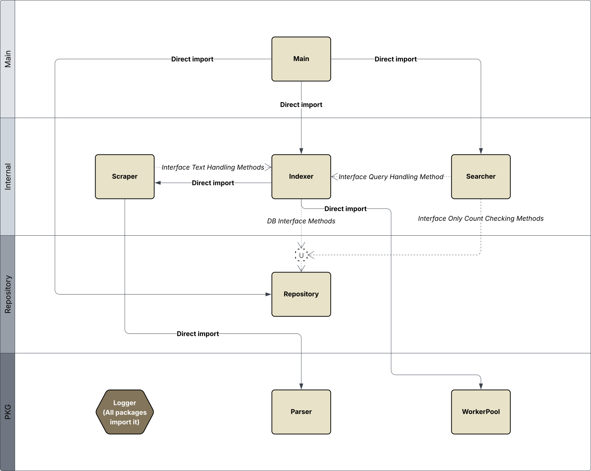

# Данный проект является многопоточным поисковым роботом, индексирующим html страницы на английском языке, с интегрированным поисковиком.

## Описание:
Проект был создан для быстрой, многопоточной индексации небольшого объема веб страниц, на английском языке(из-за относительной простоты лингвистики этого языка), с реализацией всего, возможного функционала с помощью build-in инструментов языка golang, для этих целей был реализован скрепинг с распределением задач:
```go
func (ws *WebScraper) ScrapeWithContext(ctx context.Context, currentURL *url.URL, rules *parser.RobotsTxt, depth, visDeep int) {
    if ws.checkContext(ctx, currentURL.String()) {return} //это стоит вначале, для того чтобы даже при прерывании глобального индекса страницы успевали обработаться

    if depth >= ws.cfg.Depth {
        return
    }

	ws.fetchPageRulesAndOffers(ctx, currentURL, rules, depth, visDeep) //проверка sitemap и robots.txt, для адаптации под конкретный домен

    normalized, err := normalizeUrl(currentURL.String())
    if err != nil {
        return
    }
    
	links := []*linkToken{}
    if _, loaded := ws.visited.LoadOrStore(normalized, struct{}{}); loaded && visDeep >= ws.cfg.MaxVisitedDeep { //если ссылка уже была посещена проверяем не уходим ли мы в лимит последовательных проверок посещенных ссылок
		return
	} else if loaded { //если значение последовательности не превышено смотрим кэш
		if v := ws.lru.Get(sha256.Sum256([]byte(normalized))); v != nil {
			cached := v.(cacheData)
			c, cancel := context.WithTimeout(ctx, deadlineTime)
			defer cancel()
			links, _ = ws.parseHTMLStream(c, cached.html, currentURL, rules, depth, visDeep)
		} else {
			return
		}
	} else {
		links, err = ws.fetchHTMLcontent(currentURL, ctx, normalized, rules, depth, visDeep) // если же ссылку не посещали, начинаем обработку с 0
		if err != nil {
			return
		}
	}

	if len(links) == 0 { // логгируем если нет ссылок
		ws.log.Write(logger.NewMessage(logger.SCRAPER_LAYER, logger.ERROR, "empty links in page %s\n", currentURL))
		return
	}
	
	for _, link := range links {	
		if ws.cfg.OnlySameDomain && !link.sameDomain {
			continue
		}
		
		rls := rules // передача robots.txt, если ссылки в одном домене
        if !link.sameDomain {
			rls = nil
        }

        ws.pool.Submit(func() { // отправляем задачу в worker pool
			if ws.checkContext(ctx, currentURL.String()) {return} // проверяем заранее
			c, cancel := context.WithTimeout(ws.globalCtx, crawlTime)
			defer cancel()
			ws.rlMu.Lock()
			if ws.rlMap[link.link.Host] == nil {
				ws.rlMap[link.link.Host] = NewRateLimiter(DefaultDelay) // если у домена нет лимитера, создаем дефолтный
			}
			ws.rlMu.Unlock()
			visD := 0
			if link.visited {
				visD = visDeep + 1
			}
			ws.ScrapeWithContext(c, link.link, rls, depth+1, visD)
		})
    }
}
```
### Парсер html, с фильтрацией по тегам:
```go
case "h1", "h2": // отслеживание заголовков
	tagStack = append(tagStack, [2]byte{'h', byte([]rune(tagName)[1])})

case "div":
	for _, attr := range t.Attr {
		if attr.Key == "class" || attr.Key == "id" {
			val := strings.ToLower(attr.Val)
			if strings.Contains(val, "ad") || strings.Contains(val, "banner") || strings.Contains(val, "promo") { // наивная проверка на рекламный тэг
				garbageTagStack = append(garbageTagStack, tagName)
				break
			}
		}
	}

case "script", "style", "iframe", "aside", "nav", "footer": // игнорирование текста внутри мусорных тэгов
	garbageTagStack = append(garbageTagStack, tagName)
```
### При обработке текста учитывается позиция токена в документе(среди стандартизированных токенов) для учета при ранжировании в поиске, так же хотелось бы отметить что все данные сохраняются в максимально оптимальном формате, для хранения документов используется обратный индекс типа ***слово -> id_документов_где_реализовано_слово -> частота слова + позиции в документа***, для индексации буквенных ngram используется что-то похожее ***нграмма -> слова_в_которых_она_встречается***, однако в случае ngram, сохраняются на диск они, только уогда достигнут количества слов в 100 и распределяются по батчам, после рстановки индексации, разумеется, записываются все нграммы:
```go
i := 0
pos := map[string][]model.Position{}

idx.mu.Lock()
defer idx.mu.Unlock()

allTokens := []string{}

for _, passage := range passages {
	orig, stemmed, err := idx.stemmer.TokenizeAndStem(passage.Text)
	if err != nil {
		return err
	}
	if len(stemmed) == 0 {
		continue
	}
	doc.WordCount += len(stemmed)

	allTokens = append(allTokens, orig...)
	for _, w := range stemmed {
		if w.Type == textHandling.NUMBER {
			continue
		}
		stem[w.Value]++
		pos[w.Value] = append(pos[w.Value], model.NewTypeTextObj[model.Position](passage.Type, "", i))
		i++
	}
}
```
### Стеммер игнорирует наиболее чпсто употребляемые слова, а так же разбивает на тэги, по типу WORD, ALPHANUMERIC, NUMBER, EMAIL_ADDR, и тому подобные:
```go
tokens := s.tokenizer.entityTokenize(text)
wordTokens := []string{}
stemmedTokens := []token{}
for _, t := range tokens {
	if t.Type == WORD && len(t.Value) > 0 {
		if stemmed := s.stem(t.Value); stemmed != "" { // если токен пуст оригинал тоже игнорируется
			wordTokens = append(wordTokens, t.Value)
			stemmedTokens = append(stemmedTokens, token{Type: WORD, Value: stemmed})
		}
	} else if t.Type == ALPHANUMERIC || t.Type == NUMBER || t.Type == EMAIL_ADDR || t.Type == URL_ADDR {
		stemmedTokens = append(stemmedTokens, t)
	}
}

return wordTokens, stemmedTokens, nil
```
### Чтож давайте рассмотрим самое интересное, а именно поиск и прилегающее, начнем с исправления опечаток:
```go
if len(candidates) == 0 { // просто проверка на ошибочные входные данные
    return s1
}

st := []token{}
orig := []rune(s1)
for _, candidate := range candidates {
	distance := s.levenshteinDistance(orig, []rune(candidate)) // подсчет расстояния левенштейна между токенами
    if distance <= s.maxTypo { // временная заглушка до внедрения алгоритма подсчета последовательностей слов(ngram слов)
        return candidate
    }
	if len(st) == 0 || distance <= st[len(st) - 1].score {
        st = append(st, token{
            s: candidate,
            score: distance,
        })
    }
}

stackLen := len(st)
if st[stackLen - 1].score > s.maxTypo { // если нет ни обного подходящего элемента возвращаем оригинальный токен
    return s1
}
```
### Давайте рассмотрим подготовку токенов запроса, для их обработке непосредственно в поиске:
```go
reverthIndex := []map[[32]byte]model.WordCountAndPositions{}
words, stemmed, err := idx.stemmer.TokenizeAndStem(text) // стандартизируем токены
stemmedTokens := []string{}

for i, lemma := range stemmed {
	documents, err := idx.repository.GetDocumentsByWord(lemma.Value)
	if err != nil {
		return nil, nil, err
	}
	if len(documents) == 0 {
		conds, err := idx.repository.GetWordsByNGram(words[i], idx.sc.NGramCount) // обрабатываем оригинальный токен запроса чтобы избежать искривления исправления опечатки
		if err != nil {
			return nil, nil, err
		}
		replacement := idx.sc.BestReplacement(words[i], conds) // подчитываем данные с оригинального токена
		idx.logger.Write(logger.NewMessage(logger.INDEX_LAYER, logger.DEBUG, "word '%s' replaced with '%s' in query", words[i], replacement))
		_, stem, err := idx.stemmer.TokenizeAndStem(replacement)
		if err != nil {
			return nil, nil, err
		}
		stemmed[i] = stem[0] // нам нужен только 1 токен
		documents, err = idx.repository.GetDocumentsByWord(stem[0].Value)
		if err != nil {
			return nil, nil, err
		}
	}
	stemmedTokens = append(stemmedTokens, stemmed[i].Value)
	reverthIndex = append(reverthIndex, documents)
}
```
### В целом вся функция поиска это оассчет характеристик и фичей кандидатов и их ранжирование, рассчет происходит параллельно для каждого слова запроса, с мьютексом для отсутствия гонок данных, после чего данные сортируются в основном по tf-idf и bm25, т.к. без модели это самые важные текстовые признаки, далее в модель загружаются порционно фичи со списком id для определения наилучшего кондидата:
```go
rank := make(map[[32]byte]requestRanking)

words, index, err := s.idx.HandleTextQuery(query)
if err != nil {
	s.log.Write(logger.NewMessage(logger.SEARCHER_LAYER, logger.CRITICAL_ERROR, "handling words error: %v", err))
	return nil
}

queryLen := len(words)

avgLen, err := s.idx.GetAVGLen() // стредняя длина всех документов
if err != nil {
	s.log.Write(logger.NewMessage(logger.SEARCHER_LAYER, logger.ERROR, "%v", err))
	return nil
}
	
length, err := s.repo.GetDocumentsCount()
if err != nil {
	s.log.Write(logger.NewMessage(logger.SEARCHER_LAYER, logger.ERROR, "%v", err))
	return nil
}

result := make([]*model.Document, 0)
alreadyIncluded := make(map[[32]byte]struct{})
var wg sync.WaitGroup
var rankMu sync.RWMutex
var resultMu sync.Mutex
done := make(chan struct{})

for i := range words {
	wg.Add(1)
	go func(i int) { // параллельная обработка фичей для слов запроса
		defer wg.Done()

		idf := math.Log(float64(length) / float64(len(index[i]) + 1)) + 1.0
		s.log.Write(logger.NewMessage(logger.SEARCHER_LAYER, logger.DEBUG, "len documents with word: %s, %d", words[i], len(index[i])))

		for docID, item := range index[i] {
			rankMu.RLock()
			doc, err := s.repo.GetDocumentByID(docID)
			if err != nil || doc == nil {
				rankMu.RUnlock()
				s.log.Write(logger.NewMessage(logger.SEARCHER_LAYER, logger.ERROR, "error: %v, doc: %v", err, doc))
				continue
			}
			rankMu.RUnlock()
				
			rankMu.Lock()
			r, ex := rank[docID]
			if !ex {
				rank[docID] = requestRanking{}
			}
			r.SumTokenInPackage += item.Count // число слов запроса в документе
			r.tf_idf += float64(doc.WordCount) * idf
			r.bm25 += culcBM25(idf, float64(item.Count), doc, avgLen)
			if r.TermProximity == 0 { // если фичи, подчитываемые 1 раз для этого документа еще не подсчитаны
				positions := []*[]model.Position{}
				coverage := 0.0
				docLen := 0.0
				for i := range words {
					positions = append(positions, &item.Positions)
					if l := len(index[i][docID].Positions); l > 0 {
						coverage++
						docLen += float64(l)
					}
				}
				r.TermProximity = getMinQueryDistInDoc(positions, queryLen) // минимальная длина последовательности слов запроса в документе, подумываю над тем, чтобы считать это даже если в документе представлены не все слова, но в таком случае лучше бы использовать для ранжирования не линейную модель
				r.QueryDencity = coverage / docLen
				r.QueryCoverage = coverage / float64(queryLen)

				r.WordInUrl, r.LogLenWordInURL = boyerMoorAlgorithm(strings.ToLower(doc.URL), words) // поиск слова в URL
				r.LenURL = len(doc.URL)
					
				for i := 0; i < item.Count && !r.HasWordInHeader; i++ {
					r.HasWordInHeader = item.Positions[i].Type == 'h'
				}
			}
			rank[docID] = r
			rankMu.Unlock()
	
			resultMu.Lock()
			if _, exists := alreadyIncluded[doc.Id]; exists {
				resultMu.Unlock()
				continue
			}
			alreadyIncluded[docID] = struct{}{}
			result = append(result, doc)
			resultMu.Unlock()
		}
	}(i)
}
	
go func() {
	wg.Wait()
	close(done)
}()
	
vec := []float64{}
c, cancel := context.WithTimeout(context.Background(), 5 * time.Second)
defer cancel()
select { // ожидание ответа векторизатора диной в контекст, может понадобится если ответ запрос зависнет в канале очереди
case v, ok := <-s.vectorizer.PutDocQuery(query, c):
	if !ok {
		s.log.Write(logger.NewMessage(logger.SEARCHER_LAYER, logger.CRITICAL_ERROR, "error vectorozing query"))
		return nil
	}
	vec = v[0]

case <-c.Done():
	s.log.Write(logger.NewMessage(logger.SEARCHER_LAYER, logger.CRITICAL_ERROR, "vectorizing timeout"))
	return nil
}
	
	
s.log.Write(logger.NewMessage(logger.SEARCHER_LAYER, logger.DEBUG, "result len: %d", len(result)))
	
<-done
	
filteredResult := make([]*model.Document, 0)
for _, doc := range result {
	r := rank[doc.Id]
	sumCosW := 0.0
	for _, v := range doc.WordVec {
		sumCosW += calcCosineSimilarity(v, vec) // косинусная схожесть
	}
	length := float64(len(doc.WordVec))
	r.WordsCos = sumCosW / length
	sumDistance := 0.0
	for _, v := range doc.WordVec {
		sumDistance += calcEuclidianDistance(v, vec) // евклидово расстояние
	}
	r.Dpq = sumDistance / length
	rank[doc.Id] = r
	filteredResult = append(filteredResult, doc)
}

length = len(filteredResult)
if length == 0 {
	s.log.Write(logger.NewMessage(logger.SEARCHER_LAYER, logger.DEBUG, "empty result"))
	return nil
}

sort.Slice(filteredResult, func(i, j int) bool { // сортировка по приоритету признаков, TF-IDF и BM25 крайне важны здесь, т.к. они не загружаются в модель, потому что модель обучена на стороннем датасете
	if TruncateToTwoDecimalPlaces(rank[filteredResult[i].Id].WordsCos) != TruncateToTwoDecimalPlaces(rank[filteredResult[j].Id].WordsCos) {
		return rank[filteredResult[i].Id].WordsCos > rank[filteredResult[j].Id].WordsCos
	}
	if TruncateToTwoDecimalPlaces(rank[filteredResult[i].Id].Dpq) != TruncateToTwoDecimalPlaces(rank[filteredResult[j].Id].Dpq) {
		return rank[filteredResult[i].Id].Dpq < rank[filteredResult[j].Id].Dpq
	}
	if rank[filteredResult[i].Id].bm25 != rank[filteredResult[j].Id].bm25 {
		return rank[filteredResult[i].Id].bm25 > rank[filteredResult[j].Id].bm25
	}
	if rank[filteredResult[i].Id].TermProximity != rank[filteredResult[j].Id].TermProximity {
		return rank[filteredResult[i].Id].TermProximity > rank[filteredResult[j].Id].TermProximity
	}
	return rank[filteredResult[i].Id].tf_idf > rank[filteredResult[j].Id].tf_idf
})

fl := filteredResult[:min(length, maxLen)] // отсев менее релевантных кандидатов

const width = 10
n := len(fl)
iterVal := min(width, n)
for i := range iterVal { // т.к. модель обучена на ms marco, я загружаю в нее n / 10 + 1 документов, или n / 10 документов если число не кратно 10 без остатка
	condidates := map[[32]byte]requestRanking{}
	list := [][32]byte{}

	for j := 0; ; j++ {
		idx := j * width + i
		if idx >= n { // чтобы не выйти за границу среза
			break
		}

		condidateId := fl[idx].Id
		condidates[condidateId] = rank[condidateId]
		list = append(list, condidateId)
	}

	if len(list) <= 1 { // если в выборке 1 или меньше кондидатов, нет смысла ранжировать
		continue
	}

	bestPos, err := callRankAPI(list, condidates) // запрашиваем разультат у пайтон сервера
	if err != nil {
		s.log.Write(logger.NewMessage(logger.SEARCHER_LAYER, logger.CRITICAL_ERROR, "python server error: %v", err))
    	return fl
	}

	bestElIdx := bestPos * width + i
	fl[i], fl[bestElIdx] = fl[bestElIdx], fl[i]
}
```
### Как я уже говорил модель используемая для ранжирования это **Линейная регрессия**, одученная на ms marco для пассажей, из-за этого некоторые фичи при обучении приходилось симулировать, при подготовке модели ее скор на MRR на валидационной выборке был 0.4337, для получения эмбеддингов была использована самая младшая модель **BERT**, а именно **tinyBERT-l2-h128**

## Рассмотрим конфиг:
```json
{
    "base_urls" : [ //ссылки с которых начинается обход
        "https://arxiv.org/list/cs.LG/recent",
        "https://www.jmlr.org/",
        "https://jmlr.org/papers/",
        "https://en.wikipedia.org/wiki/IEEE_Transactions_on_Pattern_Analysis_and_Machine_Intelligence?utm_source=chatgpt.com",
        "https://portal.issn.org/resource/ISSN/0162-8828?utm_source=chatgpt.com",
        "https://developer.mozilla.org/en-US/",
        "https://www.w3.org/TR/2011/WD-html5-20110405/",
        "https://github.com/whatwg/html?utm_source=chatgpt.com",
        "https://html.spec.whatwg.org/multipage/?utm_source=chatgpt.com",
        "https://url.spec.whatwg.org/?utm_source=chatgpt.com",
        "https://www.reuters.com/world/russia/?utm_source=chatgpt.com",
        "https://www.ft.com/russian-economy?utm_source=chatgpt.com",
        "https://tass.com/economy?utm_source=chatgpt.com",
        "https://stackoverflow.com",
        "https://github.com",
        "https://news.ycombinator.com",
        "https://dev.to",
        "https://reddit.com/r/programming",
        "https://medium.com/topic/technology",
        "https://techcrunch.com",
        "https://arstechnica.com",
        "https://theverge.com",
        "https://wired.com",
        "https://infoworld.com",
        "https://zdnet.com",
        "https://css-tricks.com",
        "https://smashingmagazine.com",
        "https://hackernoon.com",
        "https://spectrum.ieee.org",
        "https://digitaltrends.com",
        "https://techradar.com",
        "https://venturebeat.com",
        "https://slashdot.org"
    ],
    "info_log_path" : "info_path", //путь до файла в который будут уходить info|debug логи, установить `-` если хотите чтобы уходило в stdin
    "error_log_path" : "error_path", //путь до файла в который будут уходить error логи, установить `-` если хотите чтобы уходило в stderr
    "index_path" : "index_path", //путь в который badgerDB будет сохранять данные
    "log_channel_size" : 10000, //буфер канала логов, осторожнее с ним, если сообщение приходит при заполненном буфере оно игнорируется
    "cache_cap": 10000, //максимальный размер цепочки lru кэша, чем больше, тем больше документов могут индексироваться повторно
    "ticker_time_milliseconds" : 1000, //лимит между отправками документов на векторизацию
    "worker_count" : 40, //число горутин основного потока операций
    "task_count" : 1000, //буфер задач, куда они попадают, перед передачей воркерам
    "max_links_in_page" : 100, //максимальное учитываемое число ссылок на странице
    "max_depth_crawl" : 8, //максимальная глубина обхода
    "max_visited_depth_crawl": 2, //максимальное число последовательных переходов по посещённым ссылкам
    "ngram_count" : 3, //число символов на которые разбиваются слова, для облегчения обработки опечаток
    "max_typo" : 2, //максимальная длина опечатки
    "max_transaction_bytes" : 10485760, //максимальный размер данных в 1 транзакции badgerDB
    "only_same_domain" : false //оставаться внутри одного домена с родительскими ссылками или нет
}
```
Будте осторожны с настройкой *config_file.json*, имейте ввиду, что при условии, что дерево не будет прерываться число документов будет составлять $$B\sum_{k=0}^d L^k$$, где ***B=len(base_urls), L=len(max_links_in_page), d=max_depth***.

## Архитектура проекта:


### ***Счастливого Хэллоуина***